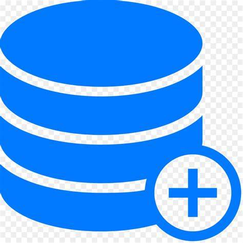
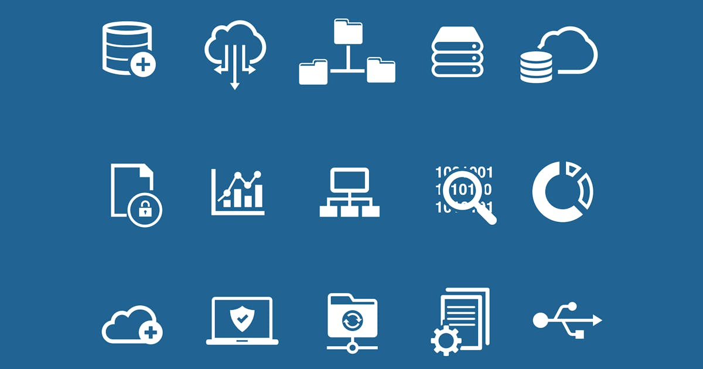

# **
Analyse de données des meurtres d'Harold Shipman
**

  

## **Sommaire**
---
### **1. Veille de Microsoft Power BI**

#### **1.A - Qu'est ce que Power BI ?**

#### **1.B - Composants**

#### **1.C - Avantages**

#### **1.D - Inconvénients**

#### **1.E - Principales fonctionnalités**

#### **1.F - Les différentes sources de données utilisables**

#### **1.G - Les différents types de visualisations**

###  **2. Contexte du projet**

#### **2.A - Données utilisées**

#### **2.B - Problématique étudiée** 

### **3. Analyse des données** 

### **4.  Conclusion** 

---
---

## **
1. Veille de Microsoft Power BI
**
---
### **
1.A - Qu'est ce que Power BI ?
**
---

**Power BI est le logiciel de [Business Intelligence](https://fr.wikipedia.org/wiki/Informatique_d%C3%A9cisionnelle) de Microsoft**. C'est l'outil d'[informatique décisionnelle](https://fr.wikipedia.org/wiki/Informatique_d%C3%A9cisionnelle) leader sur son marché (source : [powerbi.microsoft.com](https://powerbi.microsoft.com/en-gb/blog/microsoft-named-a-leader-in-the-2023-gartner-magic-quadrant-for-analytics-and-bi-platforms/)).
Il permet de créer des visuels (tableaux de bords, graphiques, cartes) qui s'alimentent à partir de plusieurs sources de données. Ces visuels sont intégrés dans des rapports dynamiques, qui peuvent être hébergés dans le cloud et rendu accessibles à de nombreux utilisateurs. 

Il s'agit d'un **ensemble de services logiciels, d'applications et de connecteurs** qui œuvrent ensemble pour **transformer des sources de données disparates en insights cohérents, visuellement immersifs et interactifs**. 

(source : [learn.microsoft.com](https://learn.microsoft.com/fr-fr/power-bi/fundamentals/power-bi-overview)).

* Qu'est ce qu'un **insight** ?

  * "Insight" est un terme anglais ayant plusieurs définitions en fonction du contexte : 

    * Dans un **contexte généraliste** "insight" signifie le fait d'**apercevoir de façon soudaine la solution d'un problème, la structure d'une figure ou d'un objet perçu**.

    * Dans le **domaine du marketing**, un "insight" est une **compréhension des besoins réels, exprimés consciemment ou non par les clients**. Il peut aussi être défni comme **une perspective centrée sur les besoins et les envies**.

    * Un "insight" peut égalment être **une valeur ou un croyance qui déclenche l'acte d'achat ou de consommation**.

    * Enfin, dans le **domaine de la publicité**, un "insight" est une **nouvelle vision commerciale sur la relation symbolique qui se noue entre une marque et son client potentiel**. 

  * Les "insights" sont généralement le **résulat d'un étude approfondie, fondée sur l'observation, l'intuition, l'introspection et la déduction de différentes questions**. Ils sont essentiels pour **comprendre pourquoi la cible pense ce qu'elle pense, agit comme elle agit et ressent ce qu'elle ressent**.

### **
1.B - Composants
**
---
**Power BI** est constitué de plusieurs éléments qui fonctionnent ensemble, dont ces **trois éléments de base** :
* Une application de bureau Windows appelée ***Power BI Desktop***.
* Un service SaaS ([Software as a Service](https://www.lebigdata.fr/definition-saas)) en ligne appelé ***service Power BI***.
* Des applications ***Power BI Mobile*** pour des appareils Windows, IOS et Android.

Ces trois éléments (Power BI Desktop, le service et les applications mobiles) sont conçus pour permettre de **créer, partager et consommer de façon optimale des insights métier**, en fonction des besoins et des rôles des utilisateurs.

Power BI comprend également **deux autres éléments** : 
* ***Power BI Report Builder***, pour la création de [rapports paginés](https://learn.microsoft.com/fr-fr/power-bi/fundamentals/power-bi-overview#paginated-reports-in-the-power-bi-service) à partager dans le service Power BI.
* ***Power BI Report Server***, qui est un serveur de [rapports local](https://learn.microsoft.com/fr-fr/power-bi/fundamentals/power-bi-overview#on-premises-reporting-with-power-bi-report-server) dans lequel il est possible de publier les rapports Power BI après les avoir créés dans Power BI Desktop. 

(source : [learn.microsoft.com](https://learn.microsoft.com/fr-fr/power-bi/fundamentals/power-bi-overview)).

### **
1.C - Avantages
**
---
* Peut être utilisé aussi bien par des utilisateurs débutants qu'expérimentés. 

* Tableaux de bord et rapports pré-conçus pour les solutions Saas.

* Tableaux de bord mis à jour en temps réel.

* Connexion aux sources de données fiable et sécurisée, aussi bien sur site que sur le Cloud.

* Déploiement rapide, configuration hybride et environnement sécurisé.

* Exploration de données en utilisant des requêtes en langage naturel.

* Nombreuses fonctionnalités de visualisation de tableau de bord.

* Intégration avec le coding en Python et R permettant de manipuler les visualisations.

* Nombreuses options disponibles pour préparer et nettoyer les données avec Power Query qui est par ailleurs propulsé par l'IA et le Machine Learning.

* Nombreuses mises à jour apportant de nouvelles fonctionnalités.
### **
1.D - Inconvénients
**
---
* Formules rigides, il est possible de créer de nouvelles données avec des formules mais il y a des limites. Il existe également une instruction concaténer, mais elle ne combine que deux éléments. Pour en conbiner d'avantage, il faut imbriquer les insctructions concaténées. Lorsque les rapports vont au-delà de simples visualisations, Power BI devient plus difficile à utiliser. [DAX](https://learn.microsoft.com/fr-fr/dax/dax-overview) n'est pas le plus souple des langages, mais il permet une multitude de calculs personalisés. Cependant, les résultats de ces calculs ne peuvent pas toujours être bien traduits visuellement.

* Capacité de traitement des données pour les versions gratuites limité, si elle est atteinte, il faut passer à la version payante.

* Configuration des visuels limitée. 

* Interface utilisateur très volumineuse.

### **
1.E - Principales fonctionnalités
**
---
* **Analyse de flux :** Power BI effectue des analyses des flux de données allant des capteurs d'usine aux médias sociaux permettant ainsi de faire une analyse en temps réel des données, facilitant ainsi la prise de décision. 

* **Techniques modernes de visualisation des données :** Power BI offre des outils de visualisation des données qui permettent de créer des rapports et des tableaux de bord interactifs.

* **Multiplicité des sources de données :** Les données peuvent être sous forme de feuille de calcul Excel ou de collection d'entrepôts de données hybrides locaux ou sur le Cloud.

* **Personalisation :** Power BI permet de personnaliser les rapports et les tableaux de bord selon les besoins spécifiques de l'utilisateur.

* **Q&A :** Power BI dispose d'une zone de questions-réponses qui permet aux utilisateurs de poser des questions en langage naturel et d'obtenir des réponses sous forme de visualisations.

* **Nettoyage et transformation des données :** Power BI offre des outils pour nettoyer et transformer les données avant de les utiliser dans les rapports.

* **Détection des anomalies et repérage des tendances :** Grâce à l'IA, Power BI peut détecter les anomalies et repérer les tendances dans les données. 

* **Création de tableaux de bord de base :** Power BI permet de créer des tableaux de bord de base pour visualiser les données.

* **Consommation de rapports et de tableaux de bord :** Les utilisateurs peuvent consommer des rapports et tableaux de bord créés par d'autres utilisateurs ou par eux-mêmes.

* **Partage et collaboration :** Power BI offre plusieurs façons de partager et de collaborer sur des rapports et des tableaux de bord. 

### **
1.F - Les différentes sources de données utilisables
**
---

Power Bi permet de se connecter à une multitude de sources de données, en voici quelques exemples : 

*  **Fichiers plats :** Ce sont des fichiers de données structurées comme les fichiers Excel, CSV, XML, JSON, etc.

*  **Base de données SQL :** Une base de données SQL est un type de base de données qui utilise le langage SQL (Structured Query Language) pour gérer les données, particulièrement utile lorsque l'on travaille avec de grandes quantités de données structurées. SQL Server, Access, Oracle, IBM DB2, MySQL, PostgreSQL, Sybase, Teradata, SAP HANA, Amazon Redshift, Google BigQuery, etc.

*  **Flux OData :** OData(Open Data Protocol) est un protocole ouvert permettant de consommer des données sur le web. Power BI peut se connecter à des services web utilisant ce protocole.

*   **Plateforme Azure Cloud :** Power BI peut se connecter à divers services Azure tels que Azure SQL Databse, Azure Synapse Analytics, Azure Data Lake Storage, etc.

*  **Services en ligne :** Power Bi peut se connecter à divers services en ligne tels que SharePoint Online, Dynalics 365, Saleforce, Google Analytics, etc.

*  **Autres sources de données :** Power BI peut également se connecter à d'autres sources de données telles que Hadoop, Exchange, Active Directory, etc.

Il est important de noter que **les données doivent être dans un format consommable** par le service Power BI. De plus, certaines sources de données peuvent nécessiter l'utilisation de Power BI Desktop ou des fonctionnalités avancées de requête de données et de modélisation dans Excel avant de pouvoir être utilisées dans le service Power BI. 

### **
1.G - Les différents types de visualisations
**
---

Power BI offre une variété de visualisations pour aider à représenter les données de manière significative. En voici quelques types : 

*  **Graphiques en aires :** Ce sont des graphiques en courbes dont la zone comprise entre l'axe et la ligne est remplie. Ils mettent en évidence l'ampleur du changement dans le temps et peuvent être utilisés pour attirer l'attention sur la tendance évolutive d'une valeur totale. 

*  **Graphiques à barres et histogrammes :** Ils sont idéaux pour comparer des valeurs spécifiques dans différentes catégories.

*  **Cartes :** Elles montrent un ou plusieurs points de données, un par ligne. 

*  **Graphiques combinés :** Il associe un histogramme et un grapique en courbes. Cette combinaison permet de comparer plus rapidement les données. 

*  **Arborescence hiérarchique :** Ce visuel permet de visualiser les données sur plusieurs dimensions. Il agrège automatiquement les données et permet d'explorer les dimensions dans n'importe quel ordre.

*  **Graphiques en anneau :** Ils affichent la relation de parties par rapport à un tout.

*  **Graphiques en entonnoir :** Ils permettent de visualiser un processus comprenant des étapes et des éléments qui passent de manière séquentielle d'une étape à la suivante.

*  **Graphiques en jauge :** Ils sont utilisés pour afficher des proportions ou des parts de marché. 

*  **Nuages de points :** Ils sont utilisés pour représenter graphiquement des données généralement nombreuses, éventuellement interprétables par l'identification de [relations](https://fr.wikipedia.org/wiki/Relation), [répartitions](https://fr.wikipedia.org/wiki/R%C3%A9partition) plus ou moins homogènes, pouvant correspondre à l'application d'une [loi normale](https://fr.wikipedia.org/wiki/Loi_normale). 

*  **Graphique en secteur :** Utilisé pour illustrer la proportion numérique de différentes catégories.

Ces visualisations peuvent être ajoutées à des rapports Power BI, spécifiées dans Questions et réponses, et épinglées à des tablaux de bord. 

---
---

  

##  **
2. Contexte du projet
**
---

**[Harold Shipman](https://fr.wikipedia.org/wiki/Harold_Shipman)** était un médecin en apparence respecté exerçant à Hyde, dans le Grand Manchester. Derrière cette façade de médecin compétent, se cachait une sinistre vérité.

Entre 1975 et 1998, il a injecté à au moins 215 de ses patients, pour la plupart agés, une dose massive d'opiacés amenant à des surdoses mortelles.

Des soupçons ont été éveillés, par la fille avocate d'une de ses victimes, lorsqu'il commit l'erreur de falsifier le testament afin qu'une partie de l'héritage lui soit légué. 

Une analyse de son ordinateur révéla qu'il modifiait rétrospectivement les dossiers de ses patients pour faire apparaître ses victimes plus malade qu'elles ne l'étaient réellement. 

Shipman ne s'était pas rendu compte que chacune de ses modifications étaient horodatées.

Des analyses sur quinze des victimes potentielles, celles-ci n'ayant pas étés incinérés, ont permis de déterminer que des doses mortelles d'héroïne, d'alcool et d'autres substances furent administrées.

Shipman fut alors jugé pour quinze meutres en 1999. Il fut alors déclaré coupable et emprisoné à vie. 

Une enquête publique fut ouverte pour tenter d'identifier d'autres crimes qu'il aurait pu commettre :  il avait bel et bien assassiné 215 personne. 

Harold Shipman est considéré comme l'un des tueurs en série les plus prolifique de l'histoire et ce cas témoigne de la fragilité de la ocnfiance et des conséquences dévastatrices de l'abus de pouvoir, ébranlant les ofndements mêmes de la profession médicale. 
 
### **
2.A - Données utilisées
**
---

Les données utilisées pour l'analyse sont les suivantes : 
* Données des 215 victimes (date de décès, nom, age ...) : [Shipman-confirmed-victims.csv](Datasets/shipman-confirmed-victims.csv)
* Données de l'heure à laquelle les patients de Shipman sont décédés comparée à l'heure à laquelle les patients d'autres médecins généraliste locaux sont décédés : [Shipman-times-comparison.csv](Datasets/shipman-times-comparison.csv)  

### **
2.B - Problématique étudiée
** 
---

  

Afin de mieux comprendre le comportement de Shipman, les premières questions à se poser suivent naturellement la méthode de questionnement et de diagnostique d'une situation ou d'une problématique "QQOQCCP" (Quoi, Qui, Où, Quand, Comment, Combien, Pourquoi), en découlera les questions fondamentales suivantes : 

* Quel est le profil type des victimes (age, genre ...) ? 
* Quand sont-elles décédés (date, heure ...) ?
* Où ont eut lieu les décès ?
* De quelle manière les victimes sont-elles décédèes ? 
* Combient sont-elles (avérées, soupçonnées) ?
* Quel est le mobile ?

---
---

  

## **
3. Analyse des données
** 
---

a faire !!!!!!
## **
4.  Conclusion
** 
---
a faire !!!!!!